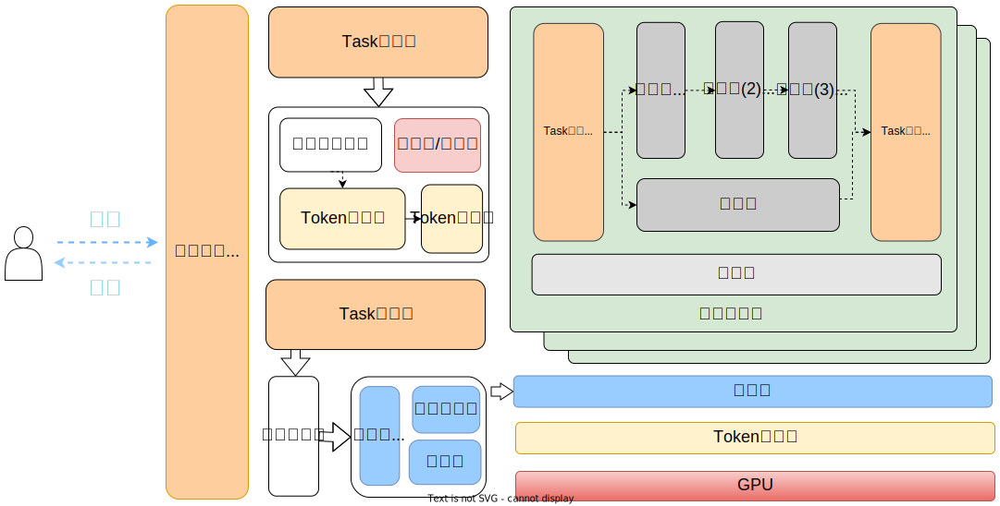

# DLIR-Allocator

We find that many types of computing-resources (such as CUDA-GPU and FPGA) have parallel waiting problem, which is bad for deep learning inference applications which are computationally intensive and delay-sensitive. To solve the above problem, one can consider intercepting API calls from the hardware driver layer, as in GPU virtualization, but this makes the generality greatly reduced and the system over-coupled. Therefore, we innovatively start from the model and create a generic allocator and mask the driver layer scheduling to alleviate the above problems, expecting to obtain better service latency for each request.

## architecture

## Develop Environment

> we test our program with `GTX-2080Ti with 10-core GPU`
* `gcc/g++` with `v8.4.0`
* `onnxruntime-gpu` with `v1.12.1`
* C++ compiler param support:
  * `-std=c++17`
  * `-lstdc++fs`
  * `-lonnxruntime`
  * `-lprotobuf`
  * `-lpthread`
  * add `-DALLOW_GPU_PARALLEL` if you only want to mask our allocator mechanism.
* [nlohmann::json](https://github.com/nlohmann/json) library installed.

## relationship with [OnnxSplitRunner](https://github.com/EdgeScheduler/OnnxSplitRunner)

In order to eliminate the negative effects of fake-multi-threading mechanism of `Python` course by `GIL`, we eventually decided to refactor the code in `C++`. Raw Project with Python can still be found at: https://github.com/EdgeScheduler/OnnxSplitRunner

## recommend
* [C++ chinese manul](https://www.apiref.com/cpp-zh/cpp/filesystem/path.html)
* [onnxruntime C++ API](https://onnxruntime.ai/docs/api/c/namespace_ort.html#details)
* [nlohmann::json](https://github.com/nlohmann/json)

## Contributors

* [Yu Tian](http://oneflyingfish.github.io)
* [Luo Diao Han](https://github.com/Arantir1028)
* [Wu Heng (Guide)](https://people.ucas.ac.cn/~wuheng)
* [Zhang wen bo (Guide)](https://people.ucas.ac.cn/~zhangwenbo)
